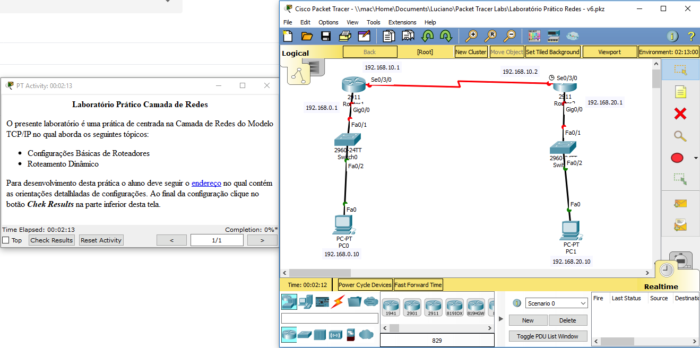
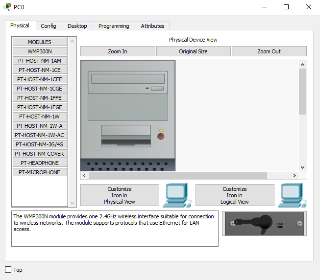

# 
 LABORATÓRIO CAMADA DE REDES

<h2 align="middle">Introdução</h2>

A Camada de Rede foca na interconexão de enlaces e redes distintas, e para resolver este problemas, são necessários dois personagens: Os protocolos de roteamento e os dispositivos de interconexão de enlaces (switchs ou roteadores)

<h2 align="middle">Sistemas Autônomos</h2>

Sistemas Autônomos (SA) são agrupamentos de roteadores administrados por um roteador central, geralmente o que está executando o protocolo BGP, conforme Figura 01, podemos observar um grupo de 3 (três) Sistemas Autônomos.

A Estrutura da Internet feita em Sistemas Autônomos dimimuita a quantidade de tabelas de roteamento replicadas, considerando que as informações inerentes as rotas interna a um SA reservam-se aos seus roteadores de borda.

<h4 align="middle">Figura 01 - Sistemas Autônomos</h4>
<h2 align="middle">Roteamento Estático</h2>

O roteamento dinâmico interconecta redes distintas, todavia, sua configuração é realizada pelo administrador do ambiente, devendo criar as rotas necessárias em cada roteador da rede, caso ocorra alguma queda do enlace os pacotes continuaram sendo encaminhados para o enlace descontinuada, somente depois da intervenção do administrador criando uma nova rota é que o problema será solucionado.

<h2 align="middle">Roteamento Dinâmico</h2>

O Roteamento Dinâmico as tabelas são criadas automáticamente pelo algoritmo de roteamento, sem intervenção do administrador do ambiente, devendo a este informar somente qual protocolo de roteamento deve-se utilizar. Os protocolos de roteamento dinâmicos utilizados na camada de rede são:

*  <b>RIP</b> – Utilizada como característica para escolha da rota o caminho mais curto, baseado na quantidade de saltos, é um protocolo interno ao Sistema Autônomo;

* <b>OSPF</b> – Tem como caracterísitca para escolha da rota o estado do enlace, que nem sempre é o caminho mais curto é um protocolo interno ao Sistema Autônomo;

* <b>BGP</b> -  Protocolo de Borda que Interconecta Sistemas Autônomos;

<h2 align="middle">Laboratório Roteamento Dinâmico</h2>

Iremos realizar a interconexão de duas redes distintas, Figura 2, usando um protocolo de roteamento dinâmico RIP, que utiliza o algoritmo de Vetor de Distância, ou seja, o melhor caminho é o que possui a menor quantidade de saltos</b>

<h4 align="middle">Figura 02 - Diagrama Rede</h4>

<h3 align="middle">Entendo a Arquitetura de um Roteador</h3>

Um roteador é um compador com função específica de interconectar redes, seu hardware funciona de uma maneira um pouco difererente de um computador pessoal, um dos principais fabricantes do mercado é a CISCO, no qual nosso laboratório estará orientado, a Figura 03, apresenta a arquitetura dos componentes principais de um roteador. 

<h4 align="middle">Figura 03 - Componentes Roteador</h4>

*  <b>RAM</b> – Armazena as tabelas de roteamento e o arquivo de configuração temporário do roteador;

* <b>NVRAM</b> – Armazena o arquivo de configuração que será utilizado na inicialização (startup config), não ocorre perca das informações armazenadas na NVRAM ao desligar o roteador;

* <b>FLASH</b> - Armazena a imagem de inicialização do Sistema Operacional, possui a possibilidade armazenar várias imagens, retém seu conteúdo quando o roteador é desligado;

* <b>ROM</b> -  Mantém instruções que definem o autoteste realizado na inicialização do roteador;

* <b>Console</b> -  É uma interface de acesso direto ao roteador para sua manutenção e atualização de firmware em caso de percado de acesso externo;

* <b>Interfaces</b> -  Conectam o roteador à rede para entrada e saída de pacotes, podem estar diretamenta conectadas na placa-mãe ou adicinadas através de módulos, em computadores pessoas são chamadas de placas de rede;

Todas as configurações realizadas em um roteador são salvas na RAM, portanto é um dado volátil, ocorrendo o desligamento inesperado a configuração feita é <b>PERDIDA</b>, daí a necessidade de salvar constante o que foi realizado na NVRAM através do comando: <i>copy running-config startup-config</i>. 

<h3 align="middle">Preparando o Ambiente para Realizar o Laboratório</h3>

Iremos utilizar um software de simualação de rede desenvolvido e disponibilizado pela própria CISCO, chamado Packet Tracer, ele pode ser executado até mesmo em computadores antigos de 32 bits, para fazer o download cadastre-se no curso:

[Introduction to Packet Tracer](https://www.microsoft.com/pt-BR/download/details.aspx?id=45520)

É um curso gratuíto de 10 horas, que não tem obrigatoriedade de sua realização, mas já disponibiliza conteúdo e a o download da ferramenta. O mais importante é que você pode até achar o arquivo de instalação do Packet Tracer na internert, todavia para liberar todas as funcionalidades da ferramenta é necessário um login criado no cadastro deste curso, vou disponiblizar a seguir o arquivo para download direto que salvei no google drive:

[Packet Tracer - 32 bits](https://drive.google.com/open?id=10PJHweyAjtvTW5J4JWVAGVdsNSeJKk9f)

[Packet Tracer - 64 bits](https://drive.google.com/open?id=1v3oJeTjKZX5XFH3iwGnDYITVQ1u1FQG_)

[Packet Tracer - Linux](https://drive.google.com/open?id=10dGsuiEm2PqPYw1F5qqx2Pkdquy4sOBQ)

Após o download faça a instalação do aplicativo que é muito simples, realize o login no mesmo, é o usuário que você cadastrou para ter acesso ao curso, e faça o download do arquivo do laboratório disponiblizado abaixo:

[Laboratório - Roteamento Dinâmico RIP](https://drive.google.com/open?id=1H6cVuwK_GAYC0BXm2RTWAelJVvFJ1O6D)

<h3 align="middle">Execução do Laboratório</h3>

Ao abrir o arquivo baixado no link acima, o Packet Tracer será aberto com duas telas, uma com o wizard que apresentará seus acerto no final e a outra com o diagrama de rede no qual você irá configurar, Figura4. 

<h4 align="middle">Figura 04 - Laboratório Packet Tracer</h4>

Objetivo do Laboratório:

*  Congigurar o endereçamento IP em todos os dispositivos do ambiente;

* Configurar o Roteamento Dinâmico RIP no <b>Router1</b> e <b>Router2</b> para que o <b>PC0</b> possa se comunicar com o <b>PC1</b>;

<h3 align="middle">Configuração do Ambiente de Rede</h3>

Seguiremos uma dinâmica no laboratório de configuração por dispositivo, acessa o dispositivo realiza todas as configurações inclusive de roteamento, se for o caso, e passa a fazer a configuração do seguinte, lembrado que o diagrama e endereçamento é o igual o apresentado na Figura 02.

O ambiente de rede apresentado não possui nenhuma configuração, somente foi acrescenta um módulo para disponibilizar uma comunicação serial entre os roteadores, acessem o <b>PC0</b> dando dois cliques em cima de uma imagem, onde será apresentado a imagem conforme Figura 05, com suas guias de configuração.

<h4 align="middle">Figura 04 - Laboratório Packet Tracer</h4>

Router>enable
Router#configure terminal
Enter configuration commands, one per line.  End with CNTL/Z.
Router(config)#interface gigabitethernet 0/0
Router(config-if)#ip address 192.168.0.1 255.255.255.0
Router(config-if)#no shutdown

Router(config-if)#
%LINK-5-CHANGED: Interface GigabitEthernet0/0, changed state to up

%LINEPROTO-5-UPDOWN: Line protocol on Interface GigabitEthernet0/0, changed state to up

Router(config-if)#exit
Router(config)#interface serial 0/3/0
Router(config-if)#ip address 192.168.10.1 255.255.255.0
Router(config-if)#no shutdown

%LINK-5-CHANGED: Interface Serial0/3/0, changed state to down
Router(config-if)#exit
Router(config)#router rip
Router(config-router)#network 192.168.0.1
Router(config-router)#network 192.168.10.1
Router(config-router)#passive-interface giGabitethernet 0/0
Router(config-router)#end
Router#
%SYS-5-CONFIG_I: Configured from console by console

Router#copy run start
Destination filename [startup-config]? 
Building configuration...
[OK]

